# 🤖 AI Tools Discovery Agent

**Automated AI tools discovery, summarization, and email digest — powered by n8n, GitHub API, and LLMs.**

[](https://www.docker.com/)
[](https://n8n.io/)
[](LICENSE)
[](https://github.com/yourusername/ai-tools-discovery-agent)

> Stay ahead of the AI curve. This agent scans GitHub for trending AI repositories, summarizes them with an LLM, and delivers a curated digest straight to your inbox — fully automated.

**Author:** Lalit Rajpurohit
**Contact:** [rajpurohitlalit181@gmail.com](mailto:rajpurohitlalit181@gmail.com)

---

## 📸 Demo


<!-- Add a demo GIF later:  -->

---

## 📑 Table of Contents

- [Highlights](#-highlights)
- [Architecture](#-architecture)
- [Quickstart](#-quickstart)
- [n8n Workflow Breakdown](#-n8n-workflow-breakdown)
- [Code Snippets](#-code-snippets)
- [SMTP Gmail Setup](#-smtp-gmail-setup)
- [Troubleshooting](#-troubleshooting)
- [Roadmap](#-roadmap)
- [Repository Structure](#-repository-structure)
- [License](#-license)
- [Contact](#-contact)

---

## ✨ Highlights

- **Zero manual effort** — Set it and forget it. Runs on your schedule.
- **GitHub API integration** — Fetches trending AI/ML repositories automatically.
- **LLM-powered summaries** — Uses OpenRouter/OpenAI to generate concise, readable descriptions.
- **Persistent storage** — Tracks discovered tools to avoid duplicates.
- **Beautiful HTML emails** — Professional digest delivered to one or many recipients.
- **Fully self-hosted** — Run locally with Docker. Your data stays yours.
- **Extensible** — Swap LLM providers, add RSS feeds, or customize the email template.

---

## 🏗 Architecture

```mermaid
flowchart LR
    A[⏰ Schedule Trigger] --> B[🌐 GitHub API]
    B --> C[✂️ Split Items]
    C --> D[📝 Edit Fields]
    D --> E[🤖 LLM Summarize]
    E --> F[📝 Edit Fields]
    F --> G[💾 Store in DB]
    G --> H[📊 Get Rows]
    H --> I[⚙️ Build HTML Email]
    I --> J[📧 Send Email]

    style A fill:#f9a825,stroke:#333
    style E fill:#7c4dff,stroke:#333
    style J fill:#43a047,stroke:#333
```



---

## 🚀 Quickstart

### 1. Create `docker-compose.yml`

```yaml
version: "3.8"
services:
  n8n:
    image: n8nio/n8n:latest
    container_name: n8n
    restart: unless-stopped
    ports:
      - "5678:5678"
    environment:
      - N8N_BASIC_AUTH_ACTIVE=true
      - N8N_BASIC_AUTH_USER=admin
      - N8N_BASIC_AUTH_PASSWORD=changeme
      - GENERIC_TIMEZONE=UTC
    volumes:
      - n8n_data:/home/node/.n8n

volumes:
  n8n_data:
```

### 2. Start the stack

```bash
docker compose up -d
```

### 3. Open n8n

Navigate to **[http://localhost:5678](http://localhost:5678)** and import the workflow from `workflow.json`.

---

## 🔧 n8n Workflow Breakdown

| Node | Purpose |
|------|---------|
| **Schedule Trigger** | Runs daily/weekly at your preferred time |
| **HTTP Request (GitHub)** | Fetches repositories matching your query |
| **Split Out** | Iterates over each repository item |
| **Edit Fields** | Extracts `name`, `description`, `url`, `stars` |
| **HTTP Request (OpenRouter)** | Sends repo data to LLM for summarization |
| **Edit Fields** | Maps LLM response to clean fields |
| **Insert Row** | Stores new tools in your database/sheet |
| **Get Rows** | Retrieves all tools for the digest |
| **Code Node** | Builds the HTML email body |
| **Send Email (SMTP)** | Delivers the digest to recipients |

### Example GitHub API Query

```
GET https://api.github.com/search/repositories?q=ai+tools+created:>2024-01-01&sort=stars&order=desc&per_page=10
```

### Example OpenRouter Request Body

```json
{
  "model": "openai/gpt-4o-mini",
  "messages": [
    {
      "role": "system",
      "content": "You are a technical writer. Summarize the following GitHub repository in 2-3 sentences, focusing on what it does and why it's useful."
    },
    {
      "role": "user",
      "content": "Repository: {{$json.name}}\nDescription: {{$json.description}}\nURL: {{$json.html_url}}"
    }
  ],
  "max_tokens": 150
}
```

---

## 💻 Code Snippets

### HTML Email Builder (n8n Code Node)

```javascript
const tools = $input.all();

let html = `
<!DOCTYPE html>
<html>
<head>
  <style>
    body { font-family: Arial, sans-serif; max-width: 600px; margin: 0 auto; }
    .tool { border-bottom: 1px solid #eee; padding: 16px 0; }
    .tool h3 { margin: 0 0 8px 0; color: #1a73e8; }
    .tool p { margin: 0; color: #555; }
    .stars { color: #f9a825; font-weight: bold; }
    a { color: #1a73e8; text-decoration: none; }
  </style>
</head>
<body>
  <h1>🤖 AI Tools Weekly Digest</h1>
  <p>Here are the latest AI tools discovered this week:</p>
`;

for (const item of tools) {
  const tool = item.json;
  html += `
  <div class="tool">
    <h3><a href="${tool.url}">${tool.name}</a></h3>
    <p>${tool.summary}</p>
    <p class="stars">⭐ ${tool.stars} stars</p>
  </div>`;
}

html += `
  <hr>
  <p style="color:#888;font-size:12px;">Generated by AI Tools Discovery Agent</p>
</body>
</html>`;

return [{ json: { html } }];
```

---

## 📧 SMTP Gmail Setup

### 1. Enable 2-Factor Authentication on your Google account

### 2. Generate an App Password

- Go to [Google App Passwords](https://myaccount.google.com/apppasswords)
- Select **Mail** and **Other (Custom name)** → "n8n"
- Copy the 16-character password

### 3. SMTP Settings

| Setting | Value |
|---------|-------|
| **Host** | `smtp.gmail.com` |
| **Port** | `465` (SSL) or `587` (TLS) |
| **Secure** | `true` (for 465) |
| **User** | `your.email@gmail.com` |
| **Password** | Your 16-char App Password |

### Multiple Recipients

**Option A:** Comma-separated in the "To" field:
```
alice@example.com, bob@example.com, charlie@example.com
```

**Option B:** Use a Split node to iterate and send individual emails.

---

## 🔥 Troubleshooting

| Issue | Cause | Fix |
|-------|-------|-----|
| **403 from GitHub** | Rate limit exceeded | Add `Authorization: Bearer <token>` header with a GitHub PAT |
| **429 from OpenRouter/OpenAI** | Quota exhausted | Check billing, reduce frequency, or use a different model |
| **SMTP Connection Refused** | Wrong port or firewall | Use port `587` with STARTTLS, check firewall rules |
| **Mermaid not rendering** | Old GitHub cache | Add a space and re-commit, or view in Preview tab |
| **Duplicate tools in email** | No deduplication logic | Add a check in the Code node or use DB unique constraints |

---

## 🗺 Roadmap

- [ ] **Relevance Ranking** — Score tools by your interests using embeddings
- [ ] **Web Dashboard** — Browse and search all discovered tools via a simple UI
- [ ] **Subscription System** — Let users subscribe to specific categories
- [ ] **RSS Feed Support** — Aggregate from Hacker News, Product Hunt, and more
- [ ] **Slack/Discord Integration** — Push digests to team channels

---

**Tips for an attractive repo:**
- Add a high-quality GIF showing the email output
- Include shields.io badges at the top
- Use a clear, visual Mermaid diagram
- Provide one-click deploy buttons (Railway, Render)

---

## 📄 License

This project is licensed under the **MIT License** — see the [LICENSE](LICENSE) file for details.

```
MIT License

Copyright (c) 2024 Lalit Rajpurohit

Permission is hereby granted, free of charge, to any person obtaining a copy...
```

---

## 📬 Contact

**Lalit Rajpurohit**
📧 [rajpurohitlalit181@gmail.com](mailto:rajpurohitlalit181@gmail.com)

Questions, suggestions, or just want to say hi? Open an issue or shoot me an email!

---

<p align="center">
  <b>If this helped you, consider giving it a ⭐</b>
</p>
